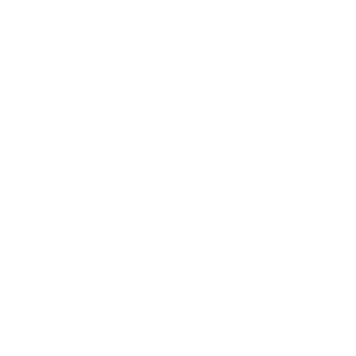

# Aigoual-Provence<html>

<head>
	  <link rel="stylesheet" href="https://maxcdn.bootstrapcdn.com/bootstrap/3.3.7/css/bootstrap.min.css">

	<title> Aigoual Provence </title> 
	<meta charset="utf-8">
	<link rel="stylesheet" type="text/css" href="style.css">
	<link href="https://fonts.googleapis.com/css?family=Indie+Flower" rel="stylesheet">
</head>

<body>

	

 		<ul class="nav-nav-tabs">
  			<li class="nav-item">
    			 <a class="nav-link-active" href="#">Accueil</a>
  			</li>
 			 <li class="nav-item dropdown">
   				 <a class="nav-link dropdown-toggle" data-toggle="dropdown" href="#" role="button" aria-haspopup="true" aria-expanded="false">Services</a>
    

			     <a class="dropdown-item" href="#">Action</a>
			     <a class="dropdown-item" href="#">Another action</a>
			     <a class="dropdown-item" href="#">Something else here</a>
     

      			 <a class="dropdown-item" href="#">something more </a>
    

 		 	</li>
 		 	<li class="nav-item">
   				 <a class="nav-link" href="#">Histoire </a>
 			</li>
  			<li class="nav-item">
    			 <a class="nav-link disabled" href="#">Contact</a>
  			</li>
		</ul>
	

	
 
		<h1> 
  

	 Aigoual Provence  </h1>
	

 
	
 Services 

	
Réparation

	
Vente

	
Traitement thermique
 

	<h3> Histoire </h3>
	

	
 
		<h4> Plusieurs générations de scieurs ont auparavant pratiqué l'activité de scierie et exploitation forestière à Meyrueis et dans le massif de l'Aigoual.

	Avec la forte demande de palettes des années 1970, l'activité s'est peu à peu déplacée vers la région <em>marseillaise </em> très <strong> demandeuse. </strong>

	Depuis la création, nous sommes également partenaires de nombreuses structures d'accompagnement de personnes en difficultés : ESAT (Esat La Farigoule,...), CHRS,  avec qui nous travaillons en étroite collaboration. </h4>  
	

	
 Nous contacter 
	
	

	

		<form id="contact_form" action="#" method="POST" enctype="multipart/form-data">
	

		<label for="name">Nom : </label> 
		<input id="name" class="input" name="name" type="text" value="" size="30" /> 
	

	

		<label for="email">Email:</label> 
		<input id="email" class="input" name="email" type="text" value="" size="30" /> 
	

	

		<label for="message"> Demande d'information :</label> 
		<textarea id="message" class="input" name="message" rows="7" cols="30"></textarea> 
	

		<input id="submit_button" type="submit" value="Send email" />
		</form>						
 	

	

		
	

</body>

</html>

/*Titres*/
body{background-image: url("Photo.jpeg");
	background-attachment: fixed;
	height: 110vh;
	background-size: cover;}
h1 {
	color: white;
	font-size: 65px;
	text-align: center;
	line-height: 200px; 
	font-family: 'Indie Flower', cursive;
	margin-bottom: 200px;
	
}
h2 {color:black
	font-size:30px;
	font-family: 'Indie Flower',cursive;
	}

h3{font-family: 'Indie Flower',cursive; 
color: white; 
text-align: center;
font-size:40px;
}

h4{font-family: 'Indie Flower',cursive; color: white}

.onglets{ 
	list-style-type: none; 
}
.MenuServices {text-align: center;
	font-family: 'Indie Flower'
font-size : 60px;
color: white}

.logo.png  {background-color: #FFFFFF;
	 color : #FFFFFF;
	 font-size: 40px;
	 position: center;
 	display: block;}

.nav-nav-tabs {
	font-family: 'Indie Flower', cursive; 
	color: white; 
	background-position: fixed; 
	background-image: url(wood.jpeg); 
	font-size: 44px; 
	position: fixed ;
	margin-top: -20px;

}
.title-landing-page{text-align: center;}

a {color: white;}

li{
	display: inline;
	margin-right: 238px;

}
.Services {color :white;
font-family: 'Indie Flower', cursive;
font-size: 50px;
text-align: center;
display}

 .contactus{text-align: center;
 	border: bottom}

 #name{text-align: center;}

 .formulaire{text-align: center;}

